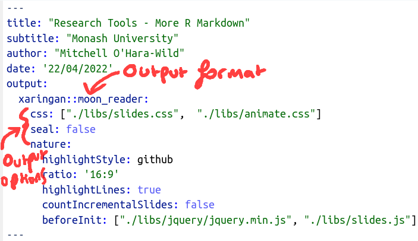

class: inverse
background-image: linear-gradient(to bottom, rgba(50, 50, 50, .8), rgba(50, 50, 50, .5)), url("resources/alfons-morales-YLSwjSy7stw-unsplash.jpg")
background-size: cover

```{css, echo=FALSE}
/* custom.css */
.left-code {
  color: #777;
  width: 48%;
  height: 92%;
  float: left;
}
.right-plot {
  width: 50%;
  float: right;
  padding-left: 1%;
}
```


```{r setup, include=FALSE}
options(htmltools.dir.version = FALSE, width = 120)

library(tidyverse)
library(knitr)
library(icons)
```

.title[Research Tools]
.sticker-float[]
.title.cursive[More R Markdown]

.cursive[(Made with R Markdown!)]

.bottom[
### Mitchell O'Hara-Wild (`r icon_style(fontawesome$brands$twitter, fill = "#1da1f2")`[@mitchoharawild](https://twitter.com/mitchoharawild))
]

---
class: inverse middle center
background-image: linear-gradient(to bottom, rgba(50, 50, 50, .8), rgba(50, 50, 50, .5)), url("resources/patrick-tomasso-Oaqk7qqNh_c-unsplash.jpg")
background-size: cover

.title.cursive[R Markdown Recap]

---
class: middle center
background-image:  url("resources/rmd_recap.png")
background-size: auto
---
class: middle center
background-image:  url("resources/rmd_structure_1.png")
background-size: auto
---
class: middle center
background-image:  url("resources/rmd_structure_2.png")
background-size: auto
---
class: middle center
background-image:  url("resources/rmd_contents_1.png")
background-size: auto
---
class: middle center
background-image:  url("resources/rmd_contents_2.png")
background-size: auto
---
class: middle center
background-image:  url("resources/rmd_contents_3.png")
background-size: auto
---
class: middle center
background-image:  url("resources/rmd_contents_4.png")
background-size: auto
---
class: middle center
background-image:  url("resources/rmd_inline.png")
background-size: auto
---
class: middle center
background-image:  url("resources/rmd_options.png")
background-size: auto
---
class: middle center
background-image:  url("resources/rmd_run_above.png")
background-size: auto
---
class: middle center
background-image:  url("resources/rmd_run_this.png")
background-size: auto
---
class: middle center
background-image:  url("resources/rmd_source.png")
background-size: auto
---
class: middle center
background-image:  url("resources/rmd_visual.png")
background-size: auto
---
class: middle center
background-image:  url("resources/rmd_knit.png")
background-size: auto
---
class: inverse middle center
background-image: linear-gradient(to bottom, rgba(50, 50, 50, .8), rgba(50, 50, 50, .5)), url("resources/richa-sharma-u8m5JYqW0Zg-unsplash.jpg")
background-size: cover

.title[Ready for...]
.title.cursive[More R Markdown?]

---
class: inverse middle center
background-image: linear-gradient(to bottom, rgba(50, 50, 50, .8), rgba(50, 50, 50, .5)), url("resources/adeolu-eletu-ohh8ROaQSJg-unsplash.jpg")
background-size: cover

.title.cursive[Output formats]

---

# Output formats

The same R Markdown code can produce output in many styles and formats.

These include:

* HTML
* PDF
* Word
* Powerpoint
* Markdown
* Even e-books! 🖥📚

Plus many more output styles are available in R packages.

---

.sticker-float[]
# Output formats (slides)

These slides are made using the `xaringan` R package.



---

.sticker-float[]
# Output formats (books)

The bookdown package allows you to write books that can be viewed anywhere (HTML, PDF, ePub & Kindle)!

This format has been used to write many R books such as [Forecasting: Principles and Practice (3rd ed)](https://otexts.com/fpp3/).

It has also been used to arrange research work into a openly accessible thesis: https://thesis.earo.me/

---

# Output formats (research)

For publishing work in common journals, look no further than the `rticles` package.

A simple change to the R Markdown's output format produces output suitable for submitting to many journals.

---

# Output formats (Monash)

Many output formats useful to staff and research students at Monash are contained in the `monash` package.

It's not on CRAN, but you can find it on GitHub here: https://github.com/numbats/monash

You can install it with:

```r
# install.packages("remotes")
remotes::install_github("numbats/monash")
```

Let's see how we can make slides and a thesis with this package's templates.

---

# Output formats (custom)

You can also create your own output formats. Usually this isn't necessary, as there is likely a suitable format already available in a package.

Making your own output format isn't too tricky, but does involve learning more about how the rmarkdown package works behind the scenes.

In the [vitae](https://github.com/mitchelloharawild/vitae) package, I've made several templates for making CVs.

More info: https://bookdown.org/yihui/rmarkdown/new-formats.html


---
class: inverse middle center
background-image: linear-gradient(to bottom, rgba(50, 50, 50, .8), rgba(50, 50, 50, .5)), url("resources/mike-hindle-OIwLUSQj4b0-unsplash.jpg")
background-size: cover

.title.cursive[Code, figures, tables & math]

---

# R Markdown: code

Despite the name, R Markdown works with many languages!

```{r}
names(knitr::knit_engines$get())
```

---

# ~~R~~ Python Markdown: code

For example, you can write Python code directly in code chunks:
````
```{python}`r ''`
import numpy as np
import matplotlib.pyplot as plt
t = np.arange(0.0, 2.0, 0.01)
plt.plot(t, 1 + np.sin(2*np.pi*t))
```
````
```{python, echo = FALSE, fig.height = 4}
import numpy as np
import matplotlib.pyplot as plt
t = np.arange(0.0, 2.0, 0.01)
plt.plot(t, 1 + np.sin(2*np.pi*t))
```


---

# R Markdown: figures

As seen in the Python chunk, when the code produces an image it is auto-magically included in the output.

````
```{r}`r ''`
library(ggplot2)
ggplot(economics, aes(date, unemploy)) + geom_line()
```
````
```{r, echo = FALSE, fig.height=4}
library(ggplot2)
ggplot(economics, aes(date, unemploy)) + geom_line()
```

---

# R Markdown: figures

You can also include figures from a file, using `knitr::include_graphics()` or directly in markdown with ``

````
```{r}`r ''`

```
````
--
```{r, echo = FALSE, fig.height=4}

```

---

# R Markdown: figures

But wait, there's options for these figures!

```{r, echo = FALSE}
tribble(
  ~ Option, ~ Description,
  "label", "All chunks should be labelled. It's extra important for figures! The chunk label is used to generate the figure's file name, and how you reference it in the text.",
  "fig.caption", "All good figures need a good caption! Add it with this chunk option.",
  "fig.align", "Alignment of the figure, such as 'center'.",
  "fig.height", "Set the height of the figure (in inches by default).",
  "fig.width", "Set the width of the figure (in inches by default).",
  "dpi", "Set the pixel density of the figure (in dots per inch).",
  "dev", "The plot device for the figure (changes file type)."
) %>% 
  knitr::kable()
```

---

# R Markdown: tables

Basic tables can be added to your document using the `knitr::kable()` function.

Simply pass it a dataframe, and it'll produce a table from it.

```{r}
library(dplyr)
chickwts %>% 
  group_by(`Feed` = feed) %>% 
  summarise(`Median weight` = median(weight)) %>% 
  arrange(desc(`Median weight`)) %>% 
  knitr::kable()
```

---

# R Markdown: tables

These `kable()` tables are customised directly with the arguments of the `kable()` function.
For example, a table caption is set with `kable(caption = 'the caption')`.

The styling options of a `kable()` table is limited, but the `kableExtra` package allows for further control of the table's appearance.

---

# R Markdown: tables

There are many alternative packages that can be used to produce tables.

A noteworthy alternative is the `gt` package, which produces beautiful tables (and possibly complex) tables in both HMTL and PDF.

Check it out here: https://github.com/rstudio/gt


---

# R Markdown: math

Math in R Markdown is typeset using LaTeX's mathematical expressions.

Math can be written inline with `$y^2 = y \times y$`: $y^2 = y \times y$

Or in a block (new line) with `$​$\mu = \dfrac{1}{N}\sum_N x_i$$`:

$$\mathbb{E}(X) = \dfrac{1}{N}\sum_N x_i$$

---

# R Markdown: math

It is also possible to label mathematical equations in a math environment.

This is done using `(\#eq:label)` at the line you'd like to number.

```
\begin{equation} 
  f\left(k\right) = \binom{n}{k} p^k\left(1-p\right)^{n-k}
  (\#eq:binom)
\end{equation}
```

This also works for aligned math environments.

---

class: inverse middle center
background-image: linear-gradient(to bottom, rgba(50, 50, 50, .8), rgba(50, 50, 50, .5)), url("resources/volodymyr-hryshchenko-ZT9gjcJog6U-unsplash.jpg")
background-size: cover

.title.cursive[Referencing, referencing, referencing.]

---

# Referencing: figures

Often you'll want to direct readers to a particular figure.

A figure reference is made using this text: `\@ref(fig:chunk-label))`

You may run into some issues if your chunk label has spaces or underscores in it, so best avoid those!


---

# Referencing: tables

Similar to how a figure is referenced from within the text, a table can be linked to using `\@ref(tab:chunk-label))`.

Good chunk labels are very helpful when it comes to referencing throughout the document.

---

# Referencing: math

If you've set a label in a math environment, you can later refer to that equation using `\@ref(eq:label)`.

---

# Referencing: sections

It is also common to link to specific sections or chapters. Just like with math referencing, to do this we need to provide a label for the section.

In the document's markdown headers, we can add `{#label}` after the header text to give it a label. For example:

```markdown
## Methods {#method}
```

Then you can later refer to this methods section using `\@ref(method)`. It is common to use `ch:` prefixes for labelling chapters, and `sec:` prefixes for section labels.


---

# Referencing: article citations

R Markdown handles the bibliography formatting for you, however you need to provide it with the bibliography data. 

This is done in the document's YAML front matter by providing a bibliography file in the `bibliography` field. For example:

```yaml
---
title: "My important research"
author: "Mitchell O'Hara-Wild"
output: html_document
bibliography: references.bib
---
```

---

# Referencing: article citations

You can obtain the bib entries for R package using the `citation()` function.

This is what a bib entries look like:

```{r}
toBibtex(citation("rmarkdown"))
```

---

# Referencing: article citations

Your preferred reference manager should be able to generate this bib file for you.

I use Zotero for this as it is free, open source, and works fine.

There are many options for reference managers, with Paperpile being a popular paid option.

---

# Referencing: article citations

```bib
@Manual{rmarkdown,
  title = {rmarkdown: Dynamic Documents for R},
  author = {JJ Allaire and Yihui Xie and Jonathan McPherson and Javier Luraschi and Kevin Ushey and Aron Atkins and Hadley Wickham and Joe Cheng and Winston Chang and Richard Iannone},
  year = {2022},
  note = {R package version 2.13},
  url = {https://github.com/rstudio/rmarkdown},
}
```

The first field in the bib entry is that article's key, which you'll use to reference it in the text.

An in-text citation can be added with `@key`, for example: 
> `Development by @rmarkdown has...`.

Citations in parenthesis are added with `[@key]`, for example: 
> `The R Markdown package [@rmarkdown] has ...`.


---
class: inverse middle
background-image: linear-gradient(to bottom, rgba(50, 50, 50, .8), rgba(50, 50, 50, .5)), url("resources/john-gibbons-JZyJxeCBtF4-unsplash.jpg")
background-size: cover

.title.cursive[Where next?]

.title[Version control]

.title.cursive[Time travelling with code]
